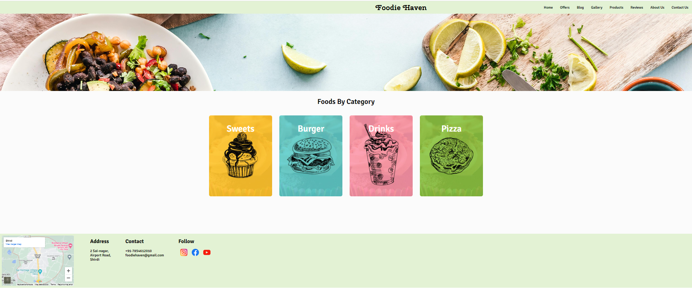

# Foodie Haven 🍱

Welcome to our Foodie Haven Our website is your one-stop destination of food products. Explore a variety delights from around the world, all conveniently showcased in one place. From fresh produce to gourmet treats, pantry staples to specialty ingredients, we've got it all.

Each product page offers detailed information, tantalizing images, and even customer reviews to help you make informed choices. Whether you're a cooking enthusiast, a foodie on the hunt for new flavors, or simply looking to stock your kitchen with the finest ingredients, our website is your go-to source for culinary inspiration and convenience.

## Way to Foodie Haven ➡️ https://foodie-haven.netlify.app/ 

# How to Contribute  🤝

We appreciate and welcome contributions from the community to help expand and improve this site. If you wish to contribute, follow these steps:

1. Fork this repository to your GitHub account.
2. Implement your changes, add new content, or fix any existing issues.
3. Open a new pull request in this repository.

# Contributors 👏

